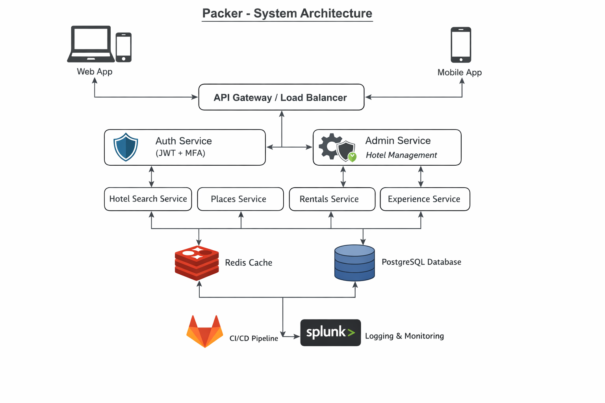

# Packer - Budget-Friendly Backpacking & Cultural Exchange Platform

## Overview
**Packer** is a backend-focused travel and cultural exchange platform designed for **budget backpackers** who prefer to plan independently while staying informed and safe in unfamiliar regions.

The platform emphasizes **information discovery, affordability, and authentic local experiences**, especially in locations where traditional booking platforms or digital infrastructure are limited.

This project is built to demonstrate **real-world backend engineering**, including secure authentication, scalable search, caching, observability, and microservice-oriented design.

---

## Problem Statement
Backpackers traveling on limited budgets often struggle with:
- Lack of reliable information in low-technology or unfamiliar regions
- Limited access to affordable lodging and rentals
- Difficulty discovering authentic cultural experiences
- Over-dependence on centralized, expensive Tour Operator platforms

**Packer addresses these gaps** by focusing on discovery, transparency, and community-driven experiences rather than purely transactional reservations.

---

## Key Features

### Implemented
- User signup and login
- JWT-based authentication
- Multi-factor authentication (MFA)
- Role-based access control (User / Admin)
- Admin-level accommodation management (add and manage accommodation data)
- Accommodation search service
- REST API gateway and service orchestration
- Redis-based caching
- Centralized logging with Splunk
- Dockerized backend services
- GitLab CI/CD pipeline

### Planned / In Progress
- Iconic places discovery by country
- Rental search and information services
- Social experience platform for cultural exchange
- Reservation and availability system
- Web and mobile frontend

---

## Architecture Overview
Packer is designed using a **microservice-oriented architecture** with stateless backend services to support scalability and cloud deployment. Administrative operations (such as managing hotel data) are protected using role-based authorization and isolated from public user-facing endpoints.

- Role based authentication handled via JWT + MFA
- Search services optimized using Redis caching
- PostgreSQL used as the primary relational data store
- Centralized logging and observability via Splunk
- CI/CD automation with GitLab pipelines
- Containerized deployment using Docker

The system is intentionally structured to reflect **production-style backend design**, even though the platform is still evolving.

---

## Technical Highlights
- **Multithreaded request handling** for concurrent workloads
- **Factory design pattern** for extensible service creation
- **Redis caching strategy** to reduce database load on search endpoints
- **JWT + MFA authentication flow** for secure access
- **Role-based authorization separating public user actions from administrative operations
- **Centralized logging** for debugging and monitoring
- **Docker + CI/CD pipelines** for reproducible builds and deployments

---

## Tech Stack

**Backend**
- Java
- Spring Boot
- Spring Security

**Data & Caching**
- PostgreSQL
- Redis

**Infrastructure & DevOps**
- Docker
- GitLab CI/CD

**Observability**
- Splunk

---

## Project Status
**Active development / backend-focused prototype**

This project is intentionally scoped to demonstrate:
- Backend system design
- Security best practices
- Scalability considerations
- Cloud-native engineering concepts

It is not positioned as a feature-complete consumer application.

---

## Why This Project Exists
Packer was built to apply and showcase:
- Real-world backend architecture
- Secure authentication and authorization
- Caching and performance optimization
- Observability and production-style engineering practices

---

## Author
**Chamath Gamage**  
Backend Engineer | Java | Cloud(AWS(SSA) & HashiCorp certified) | System Design

## License

This project is licensed under **Creative Commons Attribution-NonCommercial 4.0 International (CC BY-NC 4.0)**.

- You are free to **view, learn from, and adapt** this project for educational or research purposes.
- **Commercial use is prohibited** without explicit permission from the author.

For full license text, see [LICENSE](LICENSE). 